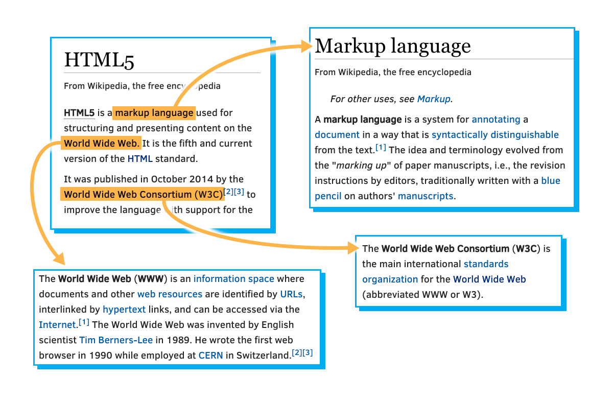

# El concepto de hipertexto

El concepto **hipertexto** nace de la necesidad de enlazar conjuntos de información relacionada de manera similar al uso que se da a las notas de pie de página en un documento, pero en un sentido más amplio y flexible. La idea es que, mediante el uso de un conjunto de marcas o etiquetas especiales, el documento se pueda romper en diferentes secciones que puedan ser posteriormente enlazadas (hiperenlaces).\
\
Así fue como en 1989, [**Tim Berners-Lee**](https://es.wikipedia.org/wiki/Tim_Berners-Lee) empezó a trabajar en la primera versión del lenguaje HTML (HyperText Markup Language), con el que ofrecer de una forma simple y uniforme la incorporación de hiperenlaces dentro de un documento de texto.\
\
El gran acierto del lenguaje HTML fue su facilidad para la interconexión de documentos entre sí de una forma no vista hasta entonces, originando los primeros documentos electrónicos enlazados a través de hipertexto que formarían lo que hoy conocemos como la _world wide web_.

<figure><figcaption>
Relación entre los conceptos lenguaje de marcas, world wide web y el W3C
</figcaption></figure>


El concepto **web** nace de la visión de [Tim Berners-Lee](https://es.wikipedia.org/wiki/Tim_Berners-Lee) de la forma de **red** que formaban todos los documentos entrelazados entre sí a través del lenguaje de hipertexto HTML. De hecho, en su metáfora, era tal el número de interconexiones y enlaces entre los diferentes documentos, que más que hablar de una larga lista de páginas, el veía un **océano** de información fluyendo en todas direcciones, por lo que la única manera de recorrer todos esos **mares** de datos era utilizando unas nuevas herramientas llamadas **navegadores**.

