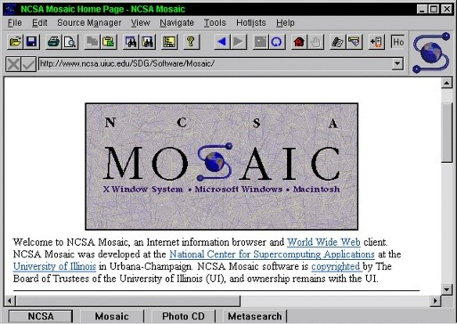

# El navegador web

Antes incluso de comenzar a implementar nuestra primera línea de código HTML, deberíamos asegurarnos de que tenemos instalado un navegador web adecuado con el que visualizar nuestras páginas.

Los navegadores más populares son en este orden: Chrome, Safari, Microsoft Edge (e IE), Firefox y Opera. Entre todos ellos suman más del 90% de la cuota de mercado a septiembre de 2022. La recomendación del autor es utilizar Google Chrome (o sucedáneo), por su contrastada compatibilidad, adecuación a las últimas novedades en los estándares web y por el nutrido surtido de herramientas para desarrollo web con que cuenta. No obstante, cualquier otro navegador de los ya indicados que se encuentre actualizado a su última versión será perfectamente válido.

Para ver el resultado de nuestra programación web es tan sencillo como hacer doble click sobre el fichero html que hayamos generado. Si deseamos abrirlo con un navegador que no sea el predeterminado, deberemos usar la opción Abrir con… del menú contextual sobre el fichero.


[**Marc Andreesen**](https://es.wikipedia.org/wiki/Marc_Andreessen) es conocido por ser el creador de [**Mosaic**](https://es.wikipedia.org/wiki/Mosaic), el primer navegador en popularizar la _world wide web_ allá por el 1993. Mosaic ofrecía un interfaz gráfico simple con la que navegar por la web y permitía que con un simple click en un hiperenlace se presentara la información en una ventana gráfica. Es sin ninguna duda, el antecesor de los navegadores actuales.


<figure><figcaption>
Interfaz del navegador Mosaic
</figcaption></figure>


Si te interesa conocer cuál es y cuál ha sido la evolución del mercado de los navegadores web, deberías echar un vistazo a la siguiente web que publica estadísticas mensuales y cuenta con un archivo de estas desde mayo de 2007 → [https://www.w3counter.com/globalstats.php](https://www.w3counter.com/globalstats.php)

