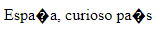
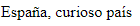
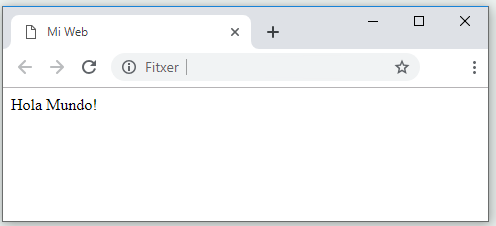

# Estructura básica de un documento HTML5

HTML5 se refiere a la última versión del estándar HTML, pues existen múltples versiones que se han ido desarrollando a lo largo de los años, entre las principales versiones de HTML existentes destacan la siguientes:

* HTML (1991).
* HTML 2.0 (1995).
* HTML 3.2 (1997).
* HTML 4.01 (1999).
* XHTML (2000).
* HTML 5 (2014).

Concretamente, la estructura básica de un documento HTML5 es la siguiente:


```html
<!DOCTYPE html>
<html lang="es">
    <head>
        <title>Título de la Web</title>
        <meta charset="UTF-8">
        <!-- Aquí se incluyen el resto de metadatos -->
    </head>
    <body>
        <!-- Aquí se incluye el contenido de la página -->
    </body>
</html>
```


Esta estructura sería la mínima imprescindible para considerar una página web como válida.


Cualquier etiqueta puede contener un número variable de atributos, separados entre sí con un espacio y estando todos ellos siempre contenidos en la propia etiqueta de inicio. El valor de un atributo siempre se debe entrecomillar e ir seguido de un igual, tras el atributo. El orden de los atributos no es relevante.\
\<tag **atributo**≈**"valor"**> \</tag>



No te olvides nunca del fin de cierre de una etiqueta, pues de lo contrario se rompe la estructura del documento, lo que puede dar lugar a comportamientos imprevisibles por parte de los navegadores o las aplicaciones que la deban abrir.


A continuación, se explica el significado de cada etiqueta y la importancia de incluirlas siempre en todas nuestras webs.

### Versión HTML

```html
<!DOCTYPE html>
```

La etiqueta **!DOCTYPE** sirve para indicar al navegador la versión de HTML que se ha utilizado para codificar la página web y poder de esta manera visualizarla correctamente. Si solamente la acompañamos del atributo **html** el navegador interpretará que se trata de HTML5, pues las anteriores versiones empleaban SGML y se especificaba el tipo de documento (DTD) a utilizar.\
Se trata de una etiqueta de tipo _singleton tag_, por ello no tendrá una etiqueta de cierre, así que con añadirla como primera línea de nuestra página web bastará.

### Raíz del documento

```html
<html lang="es">
```

La etiqueta **\<html>**, indica el elemento raíz del documento y debe envolver todo nuestro código HTML. Es importante indicar como atributo el idioma en qué está nuestra página a fin de garantizar una correcta accesibilidad de esta. En el ejemplo, se está indicando como idioma el español, pues la notación que se sigue es la definida en el formato ISO 639-1. Este tag debe cerrarse al final del documento con la etiqueta **\</html>**, por lo que esta debería ser siempre la última línea de código de una página en HTML5.

### Información general y metadatos

```html
<head>
```

Dentro de la etiqueta **\<head>** se definen los metadatos del documento, es decir aquella información no visual relativa al documento. Este tag debe cerrarse con la etiqueta **\</head>**. La mayoría de las etiquetas que van en el **\<head>** son de tipo singleton, dado que no son etiquetas propiamente de marcado o de inclusión de contenido (con la excepción de **\<title>**, **\<style>** y **\<script>**) sino que son etiquetas **\<meta>** que contienen metainformación sobre la página a través del valor de sus atributos.&#x20;

Dentro del **\<head>** encontraremos entre otras etiquetas:

#### Título

<pre class="language-html"><code class="lang-html"><strong>&#x3C;title>Título de la web&#x3C;/title>
</strong></code></pre>

El título de la web. Habitualmente se muestra en la barra de título de la pestaña del navegador. Como la mayoría de las etiquetas, debe cerrarse: **\</title>**.

#### Metadatos

```html
<meta>
```

Las etiquetas de tipo meta son _singleton tags_ y por lo tanto no tienen etiqueta de cierre, y son usadas para añadir la metainformación de la página mediante el valor de sus atributos. Estas etiquetas son usadas por los buscadores o motores de búsqueda para posicionar la web y es por ello por lo que conviene ser cuidadoso en su correcta definición. La etiqueta de metadatos que siempre debería incluirse en toda página web es la que indica la **codificación de caracteres** que se ha utilizado, pues de lo contrario, la página podría no visualizarse correctamente en nuestro navegador. Veamos ahora los atributos más utilizados para **meta** y sus respectivos valores:

#### <mark style="color:blue;">charset</mark>

Indica la codificación de caracteres utilizada en el código fuente la página web. Por razones de compatibilidad, internacionalización y accesibilidad se recomienda el uso de UNICODE UTF-8.

* <mark style="color:blue;">**charset**</mark>**="**<mark style="color:orange;">**UTF-8**</mark>**":** Indica la codificación de caracteres UTF-8.
* <mark style="color:blue;">**charset**</mark>**="**<mark style="color:orange;">**ISO-8859-1**</mark>**":** Indica la codificación de caracteres es ISO-8859-1, también conocida como Latin1. Dicha codificación únicamente soporta alfabetos latinos.


No indicar la codificación utilizada para la página web dará lugar a problemas de visualización de esta a causa de una mala interpretación de los bytes que la constituyen. Por ejemplo, si tenemos una página con el texto “España, curioso país”, y la guardamos en ISO-8859-1, que era el formato por defecto del bloc de notas de Windows 7, lo más probable es que nos encontremos con errores de visualización al cargar la web desde un navegador en Linux o MacOS.



La codificación **ISO-8859-1** solo es válida para páginas que empleen alfabetos latinos, por lo que está altamente desaconsejado su uso para la elaboración de una web de alcance internacional. Se recomienda siempre optar por codificaciones **UNICODE** como **UTF-8**.


<figure><figcaption><p>Codificación de caracteres incorrecta</p></figcaption></figure>

<figure><figcaption><p>Codificación de caracteres correcta</p></figcaption></figure>

#### <mark style="color:blue;">name</mark>

Utilizado para indicar conjuntos de metadatos sobre la autoría, generación, descripción, palabras claves... asociados a la página web.

* <mark style="color:blue;">**name**</mark>**="**<mark style="color:orange;">**author**</mark>**":** Indica el nombre del autor dentro del atributo <mark style="color:blue;">**content**</mark>.&#x20;
* <mark style="color:blue;">**name**</mark>**="**<mark style="color:orange;">**description**</mark>**":** Indica la descripción de lo que podremos encontrar en la web dentro del atributo <mark style="color:blue;">**content**</mark>.&#x20;
* <mark style="color:blue;">**name**</mark>**="**<mark style="color:orange;">**generator**</mark>**":** Indica el nombre del aplicativo utilizado para generar la web dentro del atributo <mark style="color:blue;">**content**</mark>.&#x20;
* <mark style="color:blue;">**name**</mark>**="**<mark style="color:orange;">**viewport**</mark>**":** Indica las características del diseño responsivo a través de la definición del ancho y escala dentro del atributo <mark style="color:blue;">**content**</mark>.&#x20;
* <mark style="color:blue;">**name**</mark>**="**<mark style="color:orange;">**keywords**</mark>**":** Indica el listado de palabras claves de la web dentro del atributo <mark style="color:blue;">**content**</mark>.&#x20;


Las **keywords** que definamos afectarán al **posicionamiento web** de la página en los principales buscadores, por lo que conviene ser cuidadosos cuando elijamos las palabras que vamos a marcar como “claves”.


Veamos algunos ejemplos de su aplicación:

```html
<meta charset="UTF-8" />
<meta name="author" content="Fulanito" />
<meta name="description" content="Curso de HTML5" />
<meta name="generator" content="Atom" />
<meta name="keywords" content="HTML CSS JS" />
<meta name="viewport" content="width=device-width, initial-scale 1.0" />
```

#### Recursos vinculados

```html
<link>
```

Etiqueta de tipo _singleton tag_ que sirve para enlazar hojas de estilo y recursos adicionales de la página. Veamos ahora los atributos más utilizados para **link** y sus respectivos valores:

#### <mark style="color:blue;">**rel**</mark>

Indica el tipo de recurso enlazado.

* <mark style="color:blue;">**rel**</mark>**="**<mark style="color:orange;">**stylesheet**</mark>**":** Indica que se enlaza una hoja de estilo CSS.
* <mark style="color:blue;">**rel**</mark>**="**<mark style="color:orange;">**icon**</mark>**":** Indica que se enlaza un _favicon_.

<mark style="color:blue;">**href**</mark>

Indica la URL del recurso.

#### Estilos CSS

```html
<style>Código CSS</style>
```

Etiqueta utilizada para contener código CSS. Debe cerrarse con **\</style>**.&#x20;

#### Código Javascript

```html
<script>Código Javascript</script>
```

Etiqueta utilizada para enlazar o contener código javascript. Debe cerrarse con **\</script>**.

#### URL base

<pre class="language-html"><code class="lang-html"><strong>&#x3C;base>
</strong></code></pre>

Etiqueta _singleton_ utilizada para indicar la URL base para todas las URLs relativas dentro del documento web. Solo puede existir una etiqueta **\<base>** en el **\<head>**. Emplea os atributos _href_ y _target_ que se verán más adelante.

### Contenido de la Web

<pre class="language-html"><code class="lang-html"><strong>&#x3C;body>
</strong></code></pre>

Dentro de la etiqueta **\<body>** se define la página web en sí misma con todo su contenido. Contiene todas las etiquetas que organizan y estructuran visualmente toda la información. Debe terminarse mediante la etiqueta **\</body>**. Las etiquetas para organizar el contenido HTML5 se describen en [t02-html5-organizacion-de-contenido](../t02-html5-organizacion-de-contenido/ "mention")


### Plantilla de estructura Web

Así pues, podríamos elaborar nuestra primera web a partir de la siguiente plantilla:

```html
<!DOCTYPE html>
<html lang="es">
    <head>
        <title>Mi Web</title>
        <meta charset="UTF-8">
        <meta name="author" content="David LeGon">
        <meta name="description" content="Mi primera página web">
        <meta name="keywords" content="aprender curso HTML5">
        <link rel="icon" href="./img/myIcon.ico">
    </head>
    <body>
        Hola Mundo!
    </body>
</html>
```

Si guardamos el código en un fichero de texto y lo abrimos con un navegador web, el resultado que obtendremos sería el siguiente:

<figure><figcaption><p>Previsualización código de ejemplo Hola Mundo!</p></figcaption></figure>

**Nota:** El _favicon_ solo se mostrará si existe el fichero de icono en la URL del atributo _href_ en la etiqueta **\<link>** que indicamos en nuestro **\<head>**.


Prueba ahora a escribir tu propia versión del “Hola Mundo!” pero sin mirar el código de ejemplo. Para cuando hayas acabado el curso deberías ser capaz de generar esta estructura básica de manera natural.


### Comentarios

Algo que también resulta fundamental en la elaboración de toda página web es la inclusión de comentarios dentro del código, cuya utilidad es la de proporcionar información práctica de cara a su comprensión y mantenimiento, así como también la de _desactivar_ código web que resulte inoperativo pero que por precaución no sea recomendable aún eliminarlo por completo. También puede utilizarse para comentar código web que aún no está finalizado y que por tanto es mejor dejar _desactivado'_. Para iniciar un comentario bastará con empezar una línea por '_**.**_

```html
<!-- Esto es un ejemplo de comentario -->
```

Algo que debe considerarse, es que no se pueden anidar comentarios, es decir no se puede introducir un nuevo comentario dentro de un comentario.
