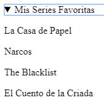

# Elementos estructurales adicionales

### Detalle y Resumen: `<`<mark style="color:green;">`details`</mark>`>` y `<`<mark style="color:green;">`summary`</mark>`>`

Cada vez es más habitual que los portales web requieran de utilidades que revelen información adicional cuando el usuario lo solicite. Para ofrecer esta posibilidad, HTML incluye el elemento `<`<mark style="color:green;">**`details`**</mark>`>`. Este elemento muestra un título, especificado mediante la etiqueta `<`<mark style="color:green;">**`summary`**</mark>`>`, y el contenido se suele representar por elementos comunes como `<`<mark style="color:green;">**`p`**</mark>`>` o `<`<mark style="color:green;">**`blockquote`**</mark>`>`.

Así pues, el elemento `<`<mark style="color:green;">**`details`**</mark>`>` se puede utilizar para revelar una lista de valores, como se aprecia en el siguiente ejemplo.

```html
<body>
   ...
   <details>
      <summary>Mis Series Favoritas</summary>
         <p>La Casa de Papel</p>
         <p>Narcos</p>
         <p>The Blacklist</p>
         <p>El Cuento de la Criada</p>
   </details>
   ...
</body>
```

<figure><figcaption><p>Efecto de las etiquetas</p></figcaption></figure>

### Figuras y Rótulos: `<`<mark style="color:green;">`figure`</mark>`>` y `<`<mark style="color:green;">`figcaption`</mark>`>` <a href="#figuras-y-rotulos" id="figuras-y-rotulos"></a>

Algunas imágenes solo actúan a modo de complemento informativo y se pueden eliminar sin que afecten al flujo de información. En estos casos debemos utilizar el elemento `<`<mark style="color:green;">**`figure`**</mark>`>` que se suele acompañar de la etiqueta `<`<mark style="color:green;">**`figcaption`**</mark>`>` para incluir texto descriptivo.

```html
<body>
   ...
   <figure>
      
      <figcaption>Lovely Tux</figcaption>
   </figure>
   ...
</body>
```

<div align="center"><figure><figcaption><p>Efecto de las etiquetas</p></figcaption></figure></div>
