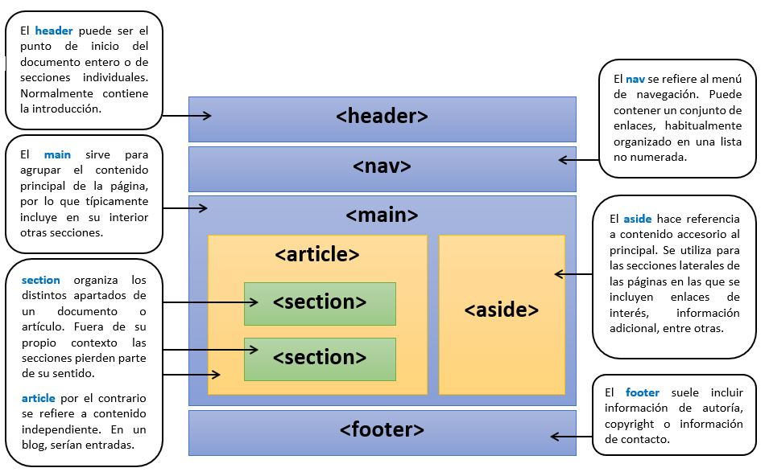

# Estructura típica del cuerpo de una web

Habitualmente el `<`<mark style="color:green;">**`body`**</mark>`>` de una página web se organiza de la siguiente manera:

<figure><figcaption><p>Estructura típica del cuerpo de una web</p></figcaption></figure>

Un ejemplo de implementación de dicha estructura podría ser:


```html
<!DOCTYPE html>
<html lang="es">
 <head>
   <meta charset="UTF-8">
   <title>Introducción a las etiquetas semánticas</title>
 </head>
 <body>
   <header>
     <h2>Este encabezado se encuentra dentro de una cabecera</h2>
   </header>
   <nav>
     <!--Esta sería la estructura de un menú de navegación básico, formado a partir de enlaces (Tema 3: Texto, Listas, Enlaces y Tablas)-->
     <a href="">Opción 1</a><br />
     <a href="">Opción 2</a><br />
     <a href="">Opción 3</a><br />
     <a href="">Opción 4</a><br />
   </nav>
   <main>
     <!--Este sería el bloque principal de la página-->
     <article>
       <h3>Primeros pasos con HTML5</h3>
       <p>Este párrafo se encuentra dentro de una sección de artículo independiente</p>
       <section>
         <h3>Tema 1: Apartado A) Etiquetas específicas</h3>
         <p>Este párrafo se encuentra dentro de una sección genérica</p>
       </section>
       <section>
         <h3>Tema 1: Apartado B) Etiquetas genéricas</h3>
         <p>Este párrafo se encuentra dentro de una sección genérica</p>
       </section>
     </article>
     <aside>
       <h3>Enlaces destacados</h3>
       <p>Este párrafo se encuentra dentro de una sección lateral</p>
     </aside>
   </main>
   <footer>
     <p>Sección de pie de página, usualmente utilizada para información de copyright, autoría, ...</p>
   </footer>
 </body>
</html>
```



El uso de las etiquetas estructurales: _`<`<mark style="color:green;">**`header`**</mark>`>, <`<mark style="color:green;">**`nav`**</mark>`>, <`<mark style="color:green;">**`main`**</mark>`>, <`<mark style="color:green;">**`article`**</mark>`>, <`<mark style="color:green;">**`section`**</mark>`>, <`<mark style="color:green;">**`aside`**</mark>`>, <`<mark style="color:green;">**`footer`**</mark>`> y <`<mark style="color:green;">**`div`**</mark>`>`_ no afecta de manera directa a cómo se visualiza la página web, pero su presencia es crucial para el software de accesibilidad y para el correcto mantenimiento y desarrollo de la web en sí misma

