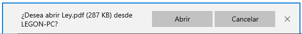

# Etiquetas de Hipervínculo


Todos los enlaces a recursos locales en el servidor web deberían escribirse siempre usando rutas relativas, pues de lo contrario se impide la migración del proyecto web a otro servidor, así como cualquier ajuste de carpetas interno. Una página web es algo “vivo” y por lo tanto debe considerarse muy seriamente cómo se van a acometer las labores de mantenimiento.


### Anchors: `<`<mark style="color:green;">`a`</mark>`>`

```html
<p id="enlaces">
  <a href="https://educem.com/">Centro de Enseñanza Educem</a><br>
  <a href="./curso.html">Curso HTML5</a><br>
  <a href="mailto:dgonzalez@educem.com">Mi correo profesional</a><br>
  <a href="#enlaces">Sección enlaces</a><br>
  <a href="https://duckduckgo.com/" target="_blank">Buscador DuckDuckGo</a>
</p>
```

Los enlaces o hipervínculos nos permiten saltar a otras páginas web o incluso a distintas zonas de nuestra misma página. Para ello debemos hacer uso de la etiqueta anchor: `<`<mark style="color:green;">**`a`**</mark>`>` ... `</`<mark style="color:green;">**`a`**</mark>`>`. Será obligatorio especificar la sección o página que se enlaza, para lo cual emplearemos el atributo **href** seguido de la **URL**. Opcionalmente indicaremos mediante el atributo **target** la manera en que debe abrirse el enlace.

Expliquemos ahora el ejemplo mostrado elemento a elemento:

```html
<a href="https://educem.com/">Centro de Enseñanza Educem</a>
```

Enlaza el texto “Centro de Enseñanza Educem” a una URL externa a nuestra página web, en este caso particular, nos redirige a: [https://educem.com/](https://educem.com/). Dado que no se especifica el atributo **target**, la redirección se realiza en la misma pestaña en la que se encuentra cargada la página actual.

```html
<a href="./curso.html">Curso HTML5</a>
```

Enlaza el texto “Curso HTML5” a una página local llamada _curso.html_ que se encuentra en la misma ubicación del servidor que la página actual.

```html
<a href="mailto:dgonzalez@educem.com">Mi correo profesional</a>
```

Al realizar click sobre “Mi correo profesional” se abre el gestor de correo predeterminado preparándose para enviar un nuevo correo a la dirección especificada, en este caso [dgonzalez@educem.com](mailto:dgonzalez@educem.com).

```html
<a href="#enlaces">Sección enlaces</a>
```

Enlaza el texto “Sección enlaces” a la sección cuyo atributo **id** sea _enlaces_, dado que así se indica en altributo **href** a través del identificador de **id** “#”. Para este caso en particular, la sección se corresponde con el inicio del párrafo.

```html
<a href="https://duckduckgo.com/" target="_blank">Buscador DuckDuckGo</a>
```

Enlaza el texto “Buscador DuckDuckGo” a una URL externa a nuestra página web, en este caso particular, nos redirige a: [https://duckduckgo.com/](https://duckduckgo.com/). Dado que se especifica el atributo **target** con el valor **\_blank**, la redirección se realiza en una nueva pestaña.


Deberías mantener la configuración por defecto para los enlaces internos de tu página y que así se abran en la propia pestaña del navegador en la que está cargada la web o de lo contrario la navegación podría resultar algo confusa. Limita la posibilidad de abrir enlaces en nuevas pestañas del navegador a aquellos enlaces externos a tu propia web, así evitarás que los usuarios dejen tu web para ir a parar a otra externa.


Los valores posibles que puede tomar el atributo **target** son:

* **\_blank**: Abre el hipervínculo en una nueva ventana o pestaña.
* **\_self**: Abre el hipervínculo en la misma pestaña (por defecto).
* **\_parent**: Abre el hipervínculo en el marco padre.
* **\_top**: Abre el hipervínculo en el cuerpo completo de la ventana.
* **framename**: Abre el hipervínculo en el marco indicado.

Un atributo interesante que podemos añadir y que se incorporó a raíz de HTML5 es el atributo **download** que indica que el recurso enlazado se descargue automáticamente al hacer click sobre el mismo. Un posible ejemplo de uso sería el siguiente:

```html
<a href="./Constitucion.pdf" download="Ley.pdf">Cosa</a>
```

Al hacer click sobre el enlace, procederemos a la descarga del recurso con el nombre indicado, en este caso _“Ley.pdf”_, aunque el fichero original se llamaba _“Constitucion.pdf”_:

<figure><figcaption><p>Ejemplo de mensaje del navegador tras hacer click a un enlace que utiliza el atributo download</p></figcaption></figure>


El atributo **download** no recibe el mismo tratamiento en todos los navegadores. Recuerda que el comportamiento de tu web está sumamente influenciado tanto por el navegador qué se utilice, como por el dispositivo a través del que se acceda, como de la versión en qué se encuentren todos los elementos del sistema. No des nada por seguro, prueba tu página en diferentes navegadores y dispositivos para garantizar la máxima fiabilidad.

