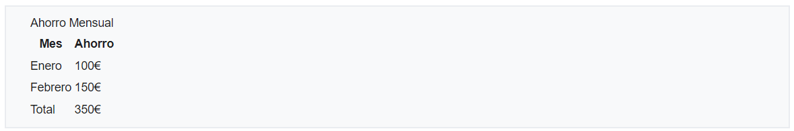
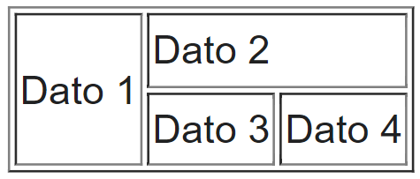

# Etiquetas de Tablas

Las tablas nos permiten organizar la información en filas y columnas. Para organizar las mismas contaremos con los siguientes tipos de etiquetas:

* Etiqueta para definir una tabla: `<`<mark style="color:green;">**`table`**</mark>`>`.
* Etiqueta para definir el título de una tabla: `<`<mark style="color:green;">**`caption`**</mark>`>`.
* Etiquetas organizar las filas: `<`<mark style="color:green;">**`thead`**</mark>`>`, `<`<mark style="color:green;">**`tbody`**</mark>`>` y `<`<mark style="color:green;">**`tfoot`**</mark>`>`.
* Etiqueta para definir las filas: `<`<mark style="color:green;">**`tr`**</mark>`>`.
* Etiqueta para definir la celdas: `<`<mark style="color:green;">**`th`**</mark>`>` y `<`<mark style="color:green;">**`td`**</mark>`>`.

Una tendencia de diseño web muy extendida a finales de los 90 y durante la primera década del 2000 era la de emplear el uso de tablas HTML para crear un layout que distribuyera los distintos elementos de la página web de una forma ordenada. Todo esto cambió a raíz de la aparición de CSS3 y el uso de técnicas como FlexBox o CSS Grid. Además, en HTML5 nunca debería emplearse etiquetas HTML con finalidades decorativas o estéticas, ya que este lenguaje está pensado para dotar a la web de una estructura que organice los contenidos y que aporte una semántica a los mismos.

### Etiquetas: `<`<mark style="color:green;">`table`</mark>`>,<`<mark style="color:green;">`caption`</mark>`>,<`<mark style="color:green;">`thead`</mark>`>,<`<mark style="color:green;">`tbody`</mark>`>,<`<mark style="color:green;">`tfoot`</mark>`>,<`<mark style="color:green;">`tr`</mark>`>,<`<mark style="color:green;">`th`</mark>`> y <`<mark style="color:green;">`td`</mark>`>`

```html
<table>
    <caption>Ahorro Mensual</caption>
    <thead>
        <tr>
            <th>Mes</th>
            <th>Ahorro</th>
        </tr>
    </thead>
    <tbody>
        <tr>
            <td>Enero</td>
            <td>100€</td>
        </tr>
        <tr>
            <td>Febrero</td>
            <td>150€</td>
        </tr>
    </tbody>
    <tfoot>
        <tr>
            <td>Total</td>
            <td>350€</td>
        </tr>
    </tfoot>
</table>
```

<figure><figcaption><p>Ejemplo de previsualización de la tabla anterior a través del navegador web</p></figcaption></figure>

Como se puede apreciar en el ejemplo, la descripción de una tabla mediante etiquetas HTML5 resulta harto compleja y conlleva un elevado número de etiquetas. Analizemos elemento a elemento la tabla presentada, a fin de entender el funcionamiento de las distintas etiquetas.

* **Título de la tabla**: Lo definimos mediante la etiqueta `<`<mark style="color:green;">**`caption`**</mark>`>` que debe añadirse <mark style="background-color:orange;">inmediatamente a continuación</mark> de la etiqueta `<`<mark style="color:green;">**`table`**</mark>`>` que define propiamente la tabla. En el caso de ejemplo el título es “Ahorro Mensual”.
* **Fila/s de título o cabecera**: Para indicar que damos inicio a una sección de cabecera en nuestra tabla, empleamos la etiqueta `<`<mark style="color:green;">**`thead`**</mark>`>` y dentro de la misma añadimos las filas que van a definir la cabecera de nuestra tabla. Normalmente será una única fila con los títulos de las columnas, pero podrían ser las que fueran oportunas. Para añadir las filas utilizamos la etiqueta `<`<mark style="color:green;">**`tr`**</mark>`>`. Finalmente definimos las celdas existentes en dicha fila, mediante el uso de la etiqueta `<`<mark style="color:green;">**`th`**</mark>`>`, pues se trata de celdas con datos de cabecera. En nuestro ejemplo, únicamente tenemos una fila de cabecera formada eso sí, por dos celdas cuyos valores son los textos “Mes” y “Ahorro”.
* **Fila/s de datos o cuerpo**: Para indicar que damos inicio al cuerpo principal de nuestra tabla, empleamos la etiqueta `<`<mark style="color:green;">**`tbody`**</mark>`>`. Dentro del cuerpo de nuestra tabla podremos definir las filas que deseemos como ya se ha expuesto mediante la etiqueta `<`<mark style="color:green;">**`tr`**</mark>`>`, definiendo eso sí, las celdas con la etiqueta `<`<mark style="color:green;">**`td`**</mark>`>`, pues son celdas de datos y no de cabecera. En nuestro ejemplo, hemos definido dos filas en total, con dos celdas por fila.
* **Fila/s de resumen o pie**: Para indicar que damos fin al conjunto de datos de la tabla y que procedemos a mostrar un resumen de los mismos, utilizamos la etiqueta `<`<mark style="color:green;">**`tfoot`**</mark>`>`. En ella añadimos tantas filas y celdas como consideremos oportuno, de la misma forma que ya se ha expuesto para el cuerpo de la tabla. Normalmente solo habrá una fila de resumen, y ese ha sido precisamente el caso de nuestro ejemplo, que en esa útlima fila se realiza un resumen de lo recopilado en el cuerpo de la tabla.


Una tabla no tiene por qué incluir todas las etiquetas presentadas, puede simplemente tener un conjunto de filas **tr** y de celdas **td**. Sed razonables y utilizad las etiquetas que realmente sean necesarias, ni más ni menos.



Las etiquetas vinculadas a las tablas son más fáciles de recordar si entendemos lo que significan en inglés:

* `<`<mark style="color:green;">**`tr`**</mark>`>`: table row.
* `<`<mark style="color:green;">**`th`**</mark>`>`: table header.
* `<`<mark style="color:green;">**`td`**</mark>`>`: table data.


### Atributos especiales _rowspan_ y _colspan_

Existen un par de atributos especiales cuyo uso es muy práctico, ya que nos permiten crear celdas que abarquen varias filas o columnas. Como es natural, estos atributos solo se pueden usar en las etiquetas que definen las celdas `<`<mark style="color:green;">**`th`**</mark>`>` o `<`<mark style="color:green;">**`td`**</mark>`>`.\
Veamos algunos ejemplos ilustrativos sobre su uso, para ello forzaremos la representación de los bordes de la tabla con el atributo “**border=1**”. En la práctica real jamás deberíamos usar el atributo “**border**” pues es un <mark style="background-color:red;">atributo prohibido en HTML5</mark>.

```html
<table border="1">
    <tr>
        <td rowspan="2">Dato 1</td>
        <td colspan="2">Dato 2</td>
    </tr>
    <tr>
        <td>Dato 3</td>
        <td>Dato 4</td>
    </tr>
</table>
```

<figure><figcaption><p>Ejemplo de previsualización de la tabla anterior a través del navegador web</p></figcaption></figure>

En la tabla de ejemplo hemos definido la primera celda de la primera fila con una expansión de 2 filas (**rowspan=”2”**) lo que implica que dicha celda se extenderá hasta la segunda fila, tal y como se aprecia en la imagen. De igual forma, hemos definido la segunda celda de la primera fila con una expansión de 2 columnas (**colspan=”2”**) lo que implica que dicha celda se extenderá hasta la tercera columna, ocupando un espacio total de 2 columnas, tal y como también podemos observar en la imagen.&#x20;

El uso de **rowspan** y **colspan** puede resultar algo confuso para los que se inician en el diseño web, por lo que al principio lo recomendable es dibujar primero la tabla que deseamos y luego pensar en las etiquetas necesarias.


Elabora los horarios de tu curso usando para ello todo lo que hemos visto sobre las tablas en HTML5. Procura utilizar también los atributos **rowspan** y **colspan**, para dotar a la tabla de una mayor complejidad y demostrar que has entendido correctamente el funcionamiento de estos dos importantes atributos.

