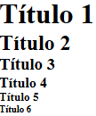
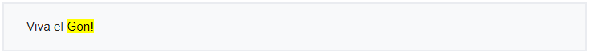

# Etiquetas de Texto

### Títulos: `<`<mark style="color:green;">`h1`</mark>`> .. <`<mark style="color:green;">`h6`</mark>`>`

```html
<h1>Título 1</h1>
<h2>Título 2</h2>
<h3>Título 3</h3>
<h4>Título 4</h4>
<h5>Título 5</h5>
<h6>Título 6</h6>
```

Sirven para establecer los títulos o encabezados de nuestra página, apartados, entradas, etc. `<`<mark style="color:green;">**`h1`**</mark>`>` se utiliza en títulos principales de máxima relevancia, y es representado típicamente por el navegador como el título de mayor tamaño y la letra en negrita. A partir del `<`<mark style="color:green;">**`h1`**</mark>`>` hasta llegar al `<`<mark style="color:green;">**`h6`**</mark>`>` iríamos reduciendo la importancia del título y el tamaño por defecto con el que el navegador lo representaría.

<figure><figcaption><p>Títulos de h1 a h6</p></figcaption></figure>

### Párrafos: `<`<mark style="color:green;">`p`</mark>`>`

```markup
<p>
    Una forma de medir el comportamiento del 
    sistema es su proporcionalidad: la diferencia 
    que hay entre el porcentaje de escaños de una 
    formación y el de votos obtenidos. La 
    experiencia muestra que en España los partidos 
    nacionales por debajo del 15% de sufragios han 
    sido penalizados con menos representantes de 
    los que conseguirían en una circunscripción 
    única.
</p>
```

Sirven para establecer los párrafos dentro de un texto. La etiqueta añade un salto de línea en blanco antes del texto, por lo que debe considerarse dicha característica a nivel visual.

### Citas: `<`<mark style="color:green;">`q`</mark>`>` y `<`<mark style="color:green;">`blockquote`</mark>`>`

```html
<q>If I look back I am lost.</q>
<blockquote>
	 The man who passes the sentence should swing  
      the sword. If you would take a man's life, 
      you owe it to him to look into his eyes and 
      hear his final words. And if you cannot bear 
      to do that, then perhaps the man does not 
      deserve to die.
</blockquote>
```

<figure><figcaption><p>Efecto de las etiquetas</p></figcaption></figure>

Ambas etiquetas sirven para delimitar citas, la diferencia reside en que `<`<mark style="color:green;">**`q`**</mark>`>` se utiliza para citas breves que no deben separarse del resto del contenido y que típicamente el navegador muestra entrecomilladas. Por el contrario, `<`<mark style="color:green;">**`blockquote`**</mark>`>` se utiliza para citas más largas que queramos destacar y separar del resto de contenido que las rodea.

### Separador de contenido: `<`<mark style="color:green;">`hr`</mark>`>`

```html
Sección 1
  <hr>
Sección 2
```

<figure><figcaption><p>Efecto de las etiquetas</p></figcaption></figure>

Sirve para establecer una ruptura en la temática del contenido. Usualmente el navegador lo representa renderizando una línea horizontal que separa el contenido.


Aunque algunas de las etiquetas que estamos presentando tienen un impacto directo sobre cómo se visualiza la página web, estas nunca deben utilizarse para dicha finalidad estética, pues el estilo visual puede ser modificado totalmente mediante reglas CSS. Las etiquetas HTML deben responder siempre a la organización semántica del contenido.


### Salto de línea: `<`<mark style="color:green;">`br`</mark>`>`

```markup
<p>
  La mariposa revolotea<br>como si desesperara<br>en este mundo<br>
</p>
```

<figure><figcaption><p>Efecto de las etiquetas</p></figcaption></figure>

El uso de esta etiqueta es el de romper la regla de los espacios en blanco y saltos de línea dentro del código (que el navegador acaba eliminando). En resumen, crea un salto de línea.

### Texto preformateado: `<`<mark style="color:green;">`pre`</mark>`>`

```html
<pre>
#include &lt;stdio.h&gt;

int main()
{
     printf("Hola mundo");
     return 0;
}
</pre>
```

<figure><figcaption><p>Efecto de las etiquetas</p></figcaption></figure>

Esta etiqueta también ayuda a romper la regla de los espacios en blanco. Se representa con una fuente monoespacio y respeta los saltos de línea, tabuladores y espacios en blanco. Resulta muy útil para ilustrar porciones de código.


Los saltos de línea y los tabuladores son eliminados por los navegadores que interpretan el código HTML5, por lo que deberás tenerlo en cuenta y usar en caso de necesitarlo las etiquetas `<`<mark style="color:green;">**`br`**</mark>`>` y `<`<mark style="color:green;">**`pre`**</mark>`>`.


### Texto en negrita/llamativo: `<`<mark style="color:green;">`b`</mark>`>`

```html
<p>
  Viva el <b>Gon!</b>
</p>
```

<figure><figcaption><p>Efecto de las etiquetas</p></figcaption></figure>

Esta etiqueta indica texto en negrita o llamativo. De acuerdo a la última especificación de HTML5 solamente se debería utilizar como último recurso y siempre que no exista una etiqueta más apropiada. Normalmente esta etiqueta puede ser sustituida por las etiquetas `<`<mark style="color:green;">**`em`**</mark>`>`, `<`<mark style="color:green;">**`strong`**</mark>`>` o `<`<mark style="color:green;">**`mark`**</mark>`>`, según el contexto.

### Texto con énfasis: `<`<mark style="color:green;">`em`</mark>`>`

```html
<p>
  Viva el <em>Gon!</em>
</p>
```

<figure><figcaption><p>Efecto de las etiquetas</p></figcaption></figure>

Esta etiqueta sirve para dar énfasis al texto que rodea. Visualmente se suele renderizar en cursiva.

### Texto importante: `<`<mark style="color:green;">`strong`</mark>`>`

```html
<p>
  Viva el <strong>Gon!</strong>
</p>
```

<figure><figcaption><p>Efecto de las etiquetas</p></figcaption></figure>

Esta etiqueta sirve para definir un texto como importante, por lo que se suele representar usando la negrita. Normalmente debería ser la opción preferente en lugar de `<`<mark style="color:green;">**`b`**</mark>`>`.

### Texto resaltado: `<`<mark style="color:green;">`mark`</mark>`>`

```html
<p>
  Viva el <mark>Gon!</mark>
</p>
```

<figure><figcaption><p>Efecto de las etiquetas</p></figcaption></figure>

Esta etiqueta sirve resaltar un texto, como se haría al subrayar las partes importantes de un fragmento de texto. Normalmente se representa destacando el texto con un fondo fosforescente.

### Texto estilísticamente distinto: `<`<mark style="color:green;">`u`</mark>`>`

```html
<p>
   Viva <u>er</u> Gon!
</p>
```

<figure><figcaption><p>Efecto de las etiquetas</p></figcaption></figure>

Esta etiqueta define un texto estilísticamente distinto del resto, normalmente indicando errores ortográficos o similares. Normalmente se representa como texto subrayado.

### Texto en cursiva/con otro acento: `<`<mark style="color:green;">`i`</mark>`>`

```html
<p>
  Viva el <i>Gon!</i>
</p>
```

<figure><figcaption><p>Efecto de las etiquetas</p></figcaption></figure>

Esta etiqueta sirve para indicar que el texto debe ser leído de forma distinta al resto del pasaje, usualmente representándose como texto en cursiva. Al igual que pasa con la etiqueta `<`<mark style="color:green;">**`b`**</mark>`>` en HTML5 solo debería usarse ante la falta de una mejor alternativa. Normalmente es mejor opción emplear cualquier de las siguientes opciones: `<`<mark style="color:green;">**`em`**</mark>`>`, `<`<mark style="color:green;">**`strong`**</mark>`>`, `<`<mark style="color:green;">**`mark`**</mark>`>`, `<`<mark style="color:green;">**`cite`**</mark>`>` o `<`<mark style="color:green;">**`dfn`**</mark>`>`.


Las etiquetas `<`<mark style="color:green;">**`b`**</mark>`>`, `<`<mark style="color:green;">**`i`**</mark>`>` y `<`<mark style="color:green;">**`u`**</mark>`>` deben emplearse con moderación y únicamente cuando no sea posible utilizar alguna otra alternativa. Esto se debe a qué estas etiquetas, aunque tienen una intencionalidad semántica, normalmente se han utilizado con fines decorativos, lo cual debería conseguirse siempre a través de CSS3 y no a través de HTML5.


### Texto para citar una obra: `<`<mark style="color:green;">`cite`</mark>`>`

```html
<p>
   <cite>El Grito</cite> 
   por Edward Munch. Pintado en 1893.
</p>
```

<figure><figcaption><p>Efecto de las etiquetas</p></figcaption></figure>

Esta etiqueta sirve para indicar el título de una obra o trabajo, generalmente una pintura, escultura, libro, canción, etc.

### Término por definir: `<`<mark style="color:green;">`dfn`</mark>`>`

```html
<p>
   <dfn>HTML5</dfn> es un standard internacional.
</p>
```

<figure><figcaption><p>Efecto de las etiquetas</p></figcaption></figure>

Esta etiqueta indica un término que a continuación se va a definir.

### Código Fuente: `<`<mark style="color:green;">`code`</mark>`>`

```html
<code>
#include <stdio.h>

int main()
{
     printf("Hola mundo");
     return 0;
}
</code>
```

<figure><figcaption><p>Efecto de las etiquetas</p></figcaption></figure>

Esta etiqueta sirve para mostrar una porción de código de programación. Se emplea una fuente monoespacio como en el caso de `<`<mark style="color:green;">**`pre`**</mark>`>` pero no se conservan saltos de líneas, tabulaciones ni espacios en blanco adicionales. No obstante, es la más adecuada para mostrar códigos fuentes.

### Superíndice y subíndice: `<`<mark style="color:green;">`sup`</mark>`>` y `<`<mark style="color:green;">`sub`</mark>`>`

```html
<p>
  La potencia 2<sup>10</sup> define un KB<sub>[1]</sub>
</p>
```

<figure><figcaption><p>Efecto de las etiquetas</p></figcaption></figure>

La etiqueta `<`<mark style="color:green;">**`sup`**</mark>`>` sirve para definir un superíndice mientras que su homóloga `<`<mark style="color:green;">**`sub`**</mark>`>` define un subíndice.

### Dirección de contacto: `<`<mark style="color:green;">`address`</mark>`>`

```html
<address>
  David LeGon<br><br>
  742 Evergreen Terrace<br>
  Springfield <br>
  USA<br>
</address>
```

<figure><figcaption><p>Efecto de las etiquetas</p></figcaption></figure>

Esta etiqueta sirve para definir una dirección de contacto del autor del documento o artículo. Normalmente todo su contenido se suele renderizar en cursiva.

### Sección de texto: `<`<mark style="color:green;">`span`</mark>`>`

```html
<p>
   Viva el <span>Gon!</span>
</p>
```

<figure><figcaption><p>Efecto de las etiquetas</p></figcaption></figure>

Esta etiqueta sirve definir una sección de texto y se usa para aplicar un estilo independiente a la sección mediante el uso de **CSS3**. Su uso es parecido al de la etiqueta `<`<mark style="color:green;">**`div`**</mark>`>` pero en este caso para organizar y dar estilo a elementos de tipo **inline** y no en bloque.

### Otras etiquetas de texto

No todas las etiquetas que se han venido utilizando históricamente continúan siendo igualmente válidas. En general todas las etiquetas sin una semántica definida que solamente ofrecían una funcionalidad estética han sido discontinuadas y eliminadas en la especificación de HTML5. Se recomienda el reemplazo de todas estas etiquetas por estilos mediante CSS3. Algunas de las etiquetas **prohibidas** son:

* `<`<mark style="color:green;">**`center`**</mark>`>`: Texto centrado.
* `<`<mark style="color:green;">**`big`**</mark>`>`: Texto mayor.
* `<`<mark style="color:green;">**`small`**</mark>`>`: Texto menor.
* `<`<mark style="color:green;">**`font`**</mark>`>`: Permite definir la fuente.
* `<`<mark style="color:green;">**`frame`**</mark>`>`: Define una sección especial.
* `<`<mark style="color:green;">**`tt`**</mark>`>`: Texto en formato teletipo.


Las etiquetas que ya no resultan aceptadas en HTML5 implicarán un error en los procesos de validación que pueden realizarse a través de: [https://validator.w3.org/nu/](https://validator.w3.org/nu/)

