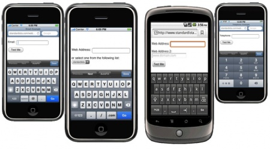

# Conceptos Básicos

### Introducción

Los formularios presentan mediante un conjunto de controles el mecanismo principal por el cual los usuarios pueden interactuar con una página o aplicación web. Cuando se envía el formulario, ya sea con un clic en el botón "enviar" o mediante programación, el navegador enviará los datos introducidos al servidor para su posterior procesado. De forma predeterminada, este envío de datos hace que la página se vuelva a cargar después de que los datos se hayan enviado, pero lógicamente este comportamiento puede ser modificado usando JavaScript.

### Contexto

Con la llegada de HTML5, los formularios web que poco habían cambiado desde 1997, evolucionaron considerablemente. Antes de la llegada del nuevo estándar los desarrolladores habían tenido que confiar las labores de diseño y control de formularios web a los diferentes _frameworks_ JavaScript como JQueryUI, Dojo o Sencha, los cuáles proporcionaban los _widgets_ requeridos y un mecanismo de validación de la entrada de datos ya fuese mediante calendarios para fechas, controles deslizantes, ... A esto debemos añadir la necesidad cada vez más acuciante de adaptación a las características específicas de las aplicaciones móviles, en la que los widgets no pueden ser los mismos que los utilizados en la versión de escritorio por razones de espacio o por el uso de teclados virtuales.

HTML5 da respuesta a las necesidades existentes y nos ofrece:&#x20;

* Un nuevo conjunto de campos de entrada que incluye una API de validación y retroalimentación visual, teclados contextualizados, etc. Por supuesto, la apariencia gráfica depende de las implementaciones del navegador web, pero la especificación de formularios HTML5 introdujo 13 nuevos campos `<`<mark style="color:green;">**`input`**</mark>**` `**<mark style="color:purple;">**`type=`**</mark><mark style="color:orange;">**`...`**</mark>**` `**<mark style="color:green;">**`/`**</mark>`>` : **email**, **tel**, **color**, **url**, **date**, **datetime**, **datetime-local**, **month**, **week**, **time**, **range**, **number** y **search**. Todos ellos se añaden a los ya existentes en HTML4: **text**, **password**, **checkbox**, **radio**, **button** y **submit**
* Un sistema de validación de entrada de datos incorporado: API de JavaScript para validación personalizada, pseudo clases CSS que son útiles para cambiar el estilo de campo de entrada dependiendo de la validez de la entrada.
* Otras ventajas, como la opción de establecer un campo de entrada fuera de `<`<mark style="color:green;">**`form`**</mark>`>`, elementos nuevos como `<`<mark style="color:green;">**`datalist`**</mark>`>` para autocompletar, `<`<mark style="color:green;">**`output`**</mark>`>` para _feedback_, etc.

<figure><figcaption>
Diferentes ejemplos de teclados contextuales que varían en función del valor <em>type</em> del campo &#x3C;input>
</figcaption></figure>
