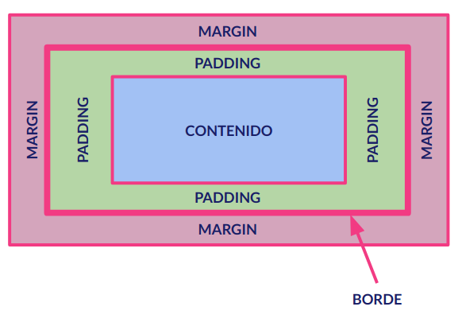
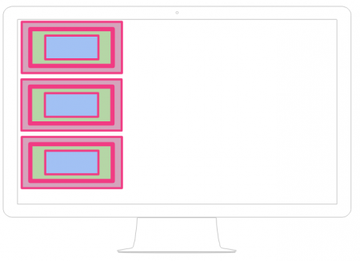
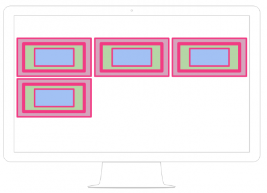

# El Modelo de Caja

Una de los aspectos más importantes que debemos considerar al desarrollar nuestro código CSS es que todos y cada uno de los elementos de una página web son cajas. Esto implica, que todos los elementos HTML presentan la siguiente estructura visual:

<figure><figcaption></figcaption></figure>

El modelo de caja nos muestra una serie de elementos cuyas características son esenciales para poder determinar correctamente la distribución de los elementos en pantalla:

* **Contenido**: Es el elemento fundamental, sería el texto en las etiquetas de texto, la imagen en las etiquetas de imagen, etc.
* **Padding**: Es el margen interno, o lo que es lo mismo, la distancia entre el contenido y el borde de la caja.
* **Borde**: Es la frontera entre nuestra caja y el resto de cajas de la página.
* **Margen**: Es el margen externo, o lo que es lo mismo, la distancia entre el borde de la caja y el resto de elementos de la página.

\
Los diferentes navegadores precargan una serie de valores por defecto a estas propiedades que controlan el modelo de caja, lo que significa que la misma página web puede visualizarse de formas distintas dependiendo del navegador. Una buena práctica de diseño web consiste precisamente en resetear a "0" los valores de las propiedades que controlan los márgenes externos e internos para todos los elementos de la página, de manera que se garantice su correcta visualización independientemente del navegador utilizado.\
El código necesario sería el siguiente:

```css
*{
    margin: 0;
    padding: 0;
 }
```

#### Distribución de elementos tipo _block_

Los elementos HTML de tipo _block_ son elementos que, independientemente de la anchura que tengan, se separan verticalmente de los elementos anteriores y posteriores. El efecto visual es parecido al de realizar un salto de línea antes del elemento en cuestión y uno después.

Representado esto gráficamente sería algo así:

<figure><figcaption></figcaption></figure>

#### Distribución de elementos tipo _inline_

Los elementos HTML de tipo _inline_ son elementos que se van sucediendo a lo largo de la misma línea, mientras caben, uno detrás de otro y de izquierda a derecha. Cuando no caben en pantalla, pasan a la línea siguiente. El efecto visual es el de _fluir_ dependiendo de la anchura de la pantalla de nuestro navegador.

Representado este comportamiento gráficamente sería algo así:

<figure><figcaption></figcaption></figure>


Recuerda que dispones de información sobre los elementos de tipo _block_ y tipo _inline_ en el apartado: [block-vs-inline.md](../t02-html5-organizacion-de-contenido/block-vs-inline.md "mention")

