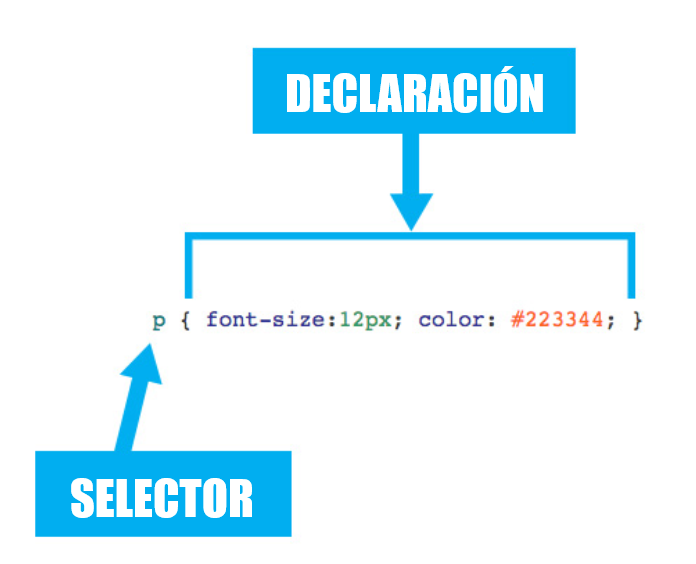

# Selectores Básicos

<details>

<summary>SUMARIO</summary>

[#selector-universal](selectores-basicos.md#selector-universal "mention")

[#selector-de-etiqueta](selectores-basicos.md#selector-de-etiqueta "mention")

[#selector-multiple](selectores-basicos.md#selector-multiple "mention")

[#selector-descendente](selectores-basicos.md#selector-descendente "mention")

[#selector-de-clase](selectores-basicos.md#selector-de-clase "mention")

[#selector-de-identificador](selectores-basicos.md#selector-de-identificador "mention")

</details>

Para crear diseños web profesionales, es imprescindible conocer y dominar los selectores de CSS. Como ya se ha comentado, una regla de CSS está formada por una parte llamada "selector" y otra parte llamada "declaración". La declaración indica "qué hay que hacer" y el selector indica "a quién hay que hacérselo". Por lo tanto, los selectores son imprescindibles para aplicar de forma correcta los estilos CSS en una página.

<figure><figcaption></figcaption></figure>

A un mismo elemento HTML se le pueden aplicar varias reglas CSS y cada regla CSS puede aplicarse a un número ilimitado de elementos. En otras palabras, una misma regla puede aplicarse sobre varios selectores y un mismo selector se puede utilizar en varias reglas.

El estándar CSS3 incluye más de una decena de tipos diferentes de selectores, que permiten seleccionar de forma muy precisa elementos individuales o conjuntos de elementos dentro de una página web. No obstante, la mayoría de páginas de los sitios web se pueden diseñar utilizando solamente los seis selectores básicos.

### Selector Universal

Se utiliza para seleccionar todos los elementos de la página. El siguiente ejemplo elimina el margen y el relleno de todos los elementos HTML:

```css
*{
  margin: 0;
  padding: 0;
}
```

El selector universal se indica mediante un asterisco "**\***". A pesar de su sencillez, solo se suele utilizar para resetear los márgenes, ya que es difícil que un mismo estilo se pueda aplicar a todos los elementos de una página.

### Selector de Etiqueta

Selecciona todos los elementos de la página cuya etiqueta HTML coincide con el valor del selector. El siguiente ejemplo selecciona todos los enlaces (_anchors_) de la página web:

```css
a {
  ...
}
```

Para utilizar este selector, solamente es necesario indicar el nombre de una etiqueta HTML (sin los caracteres "<" y ">") correspondiente a los elementos que se quieren seleccionar.

### Selector Múltiple

CSS permite agrupar todas las reglas individuales en una sola regla con un selector múltiple. Para ello, se incluyen todos los selectores separados por una coma (,). Si deseamos aplicar el mismo estilo por ejemplo a los títulos de nivel 1, 2 y 3, lo más práctico sería elaborar la siguiente regla:

```css
h1, h2, h3 {
  color: #FF0027;
  font-weight: normal;
}
```

En las hojas de estilo complejas, es habitual agrupar las propiedades comunes de varios elementos en una única regla CSS y posteriormente definir las propiedades específicas de esos mismos elementos. El siguiente ejemplo establece en primer lugar las propiedades comunes de los títulos de nivel 1, 2 y 3 y a continuación, establece el tamaño de letra de cada uno de ellos:

```css
h1, h2, h3 {
  color: #FF0027;
  font-weight: normal;
}

h1 { font-size: 2em; }
h2 { font-size: 1.5em; }
h3 { font-size: 1.2em; }
```

### Selector Descendente

Selecciona los elementos que se encuentran dentro de otros elementos. Un elemento es descendiente de otro cuando se encuentra entre las etiquetas de apertura y de cierre del otro elemento.\
El selector del siguiente ejemplo selecciona todos los elementos `<`<mark style="color:green;">**`span`**</mark>`>` de la página que se encuentren dentro de un elemento `<`<mark style="color:green;">**`p`**</mark>`>`:

```css
p span { color: red; }
```

Si el código HTML de la página es el siguiente:

```css
<p>
  ...
  <span>Hola Gon!</span>
  ...
  <a href="#">...<span>Osona</span></a>
  ...
</p>
```

El selector <mark style="color:purple;">**`p`**</mark> <mark style="color:purple;">**`span`**</mark> selecciona tanto `Hola Gon!` como `Osona`. El motivo es que en el selector descendente, un elemento no tiene que ser descendiente directo del otro. La única condición es que un elemento debe estar dentro de otro elemento, sin importar el nivel de profundidad en el que se encuentre. Al resto de elementos `<`<mark style="color:green;">**`span`**</mark>`>` de la página que no están dentro de un elemento `<`<mark style="color:green;">**`p`**</mark>`>`, no se les aplica la regla CSS anterior.

Los selectores descendentes permiten aumentar la precisión del selector de tipo o etiqueta. Así, utilizando el selector descendente es posible aplicar diferentes estilos a los elementos del mismo tipo.\
La sintaxis formal del selector descendente se muestra a continuación:

```css
selector1 selector2 selector3 ... selectorN
```

Los selectores descendentes siempre están formados por dos o más selectores separados entre sí por espacios en blanco. El último selector indica el elemento sobre el que se aplican los estilos y todos los selectores anteriores indican el lugar en el que se debe encontrar ese elemento. Se puede restringir el alcance del selector descendente combinándolo con el selector universal. El siguiente ejemplo, muestra los dos enlaces de color rojo:

```html
<!DOCTYPE html>
<html lang="es">
  <head>
    <style>
       p a { color: red; }
    </style>
  </head>
  <body>
    <p><a href="#">Enlace</a></p>
    <p><span><a href="#">Enlace</a></span></p>
  </body>
</html>
```

Sin embargo, en el siguiente ejemplo solamente el segundo enlace se muestra de color rojo:

```html
<!DOCTYPE html>
<html lang="es">
  <head>
    <style>
       p * a { color: red; }
    </style>
  </head>
  <body>
    <p><a href="#">Enlace</a></p>
    <p><span><a href="#">Enlace</a></span></p>
  </body>
</html>
```

La razón es que el selector <mark style="color:purple;">**`p`**</mark>**` ``*`` `**<mark style="color:purple;">**`a`**</mark> se interpreta como todos los elementos de tipo `<`<mark style="color:green;">**`a`**</mark>`>` que se encuentren dentro de cualquier elemento que, a su vez, se encuentre dentro de un elemento de tipo `<`<mark style="color:green;">**`p`**</mark>`>`. Como el primer elemento `<`<mark style="color:green;">**`a`**</mark>`>` se encuentra directamente bajo un elemento `<`<mark style="color:green;">**`p`**</mark>`>`, no se cumple la condición del selector <mark style="color:purple;">**`p`**</mark>**` ``*`` `**<mark style="color:purple;">**`a`**</mark>.

### Selector de Clase

Selecciona los elementos cuyo valor para el atributo **`class`** coincida con el del selector de clase. La sintaxis del selector de clase consiste básicamente en añadir un "." como prefijo al valor del atributo **`class`** que deseamos seleccionar.

```css
.valorAtributoClass { ... }
```

Los selectores de clase son imprescindibles para diseñar páginas web complejas, ya que permiten disponer de una precisión total al seleccionar los elementos. Además, estos selectores permiten reutilizar los mismos estilos para varios elementos diferentes. A continuación se muestra un ejemplo de como utilizar los selectores de clase:

```html
<!DOCTYPE html>
<html lang="es">
  <head>
    <style>
      .destacado { color: red; }
    </style>
  </head>
  <body>
    <p class="destacado">Lorem ipsum dolor sit amet...</p>
    <p>Nunc sed lacus et <a href="#" class="destacado">est adipiscing</a> accumsan...</p>
    <p>Class aptent taciti <em class="destacado">sociosqu ad</em> litora...</p>
  </body>
</html>
```

En el ejemplo anterior, tanto el primer párrafo `<`<mark style="color:green;">**`p`**</mark>`>` como los elementos `<`<mark style="color:green;">**`a`**</mark>`>` y `<`<mark style="color:green;">**`em`**</mark>`>` presentan un atributo **`class="`**<mark style="color:blue;">**`destacado`**</mark>**`"`**, por lo que se les aplican las reglas CSS indicadas por el selector <mark style="color:blue;">**`.destacado`**</mark>.\
Si se requiere es posible limitar el alcance del selector de clase combinándolo con un selector de etiqueta que debe anteponerse al mismo sin espacios en blanco. Por ejemplo, si en el ejemplo anterior desearamos limitar la aplicación del color de texto rojo a únicamente los textos con émfasis (`<`<mark style="color:green;">**`em`**</mark>`>`), la manera de hacerlo sería empleando el siguiente selector:

```css
em.destacado { color: red; }
```

De lo anterior se deduce que el selector <mark style="color:blue;">**`.destacado`**</mark> es equivalente a <mark style="color:blue;">**`*.destacado`**</mark>, por lo que todos los diseñadores obvian el símbolo **\*** al escribir un selector de clase normal.\
No conviene olvidar tampoco, que es posible aplicar los estilos de varias clases CSS sobre un mismo elemento. La sintaxis es similar, pero los diferentes valores del atributo **`class`** se separan con espacios en blanco.\
Sirva de ejemplo el siguiente código:

```html
<!DOCTYPE html>
<html lang="es">
  <head>
    <style>
      .error { color: red; }
      .destacado { font-size: 15px; }
      .especial  { font-weight: bold; }
    </style>
  </head>
  <body>
    <p class="especial destacado error">Párrafo de texto...</p>
  </body>
</html>
```

Al párrafo anterior se le aplican los estilos definidos en las reglas <mark style="color:blue;">**`.especial`**</mark>, <mark style="color:blue;">**`.destacado`**</mark> y <mark style="color:blue;">**`.error`**</mark>, por lo que el texto del párrafo se vería de color rojo, en negrita y con un tamaño de letra de 15 píxeles. Igualmente es posible elaborar selectores multiclase, como el siguiente:

```css
.error.destacado { color: blue; }
```

El selector multiclase anterior seleccionaría únicamente aquellos elementos HTML que presentasen como mínimo los 2 valores de clase del selector, es decir, que incluyesen a su vez la clase "error" y la clase "destacado".

### Selector de Identificador

En ocasiones, es necesario aplicar estilos CSS a un único elemento de la página. Aunque puede utilizarse un selector de clase para aplicar estilos a un único elemento, existe otro selector más eficiente en este caso.\
El selector de <mark style="color:blue;">**`#id`**</mark> permite seleccionar un elemento de la página a través del valor de su atributo **`id`**. Este tipo de selectores sólo seleccionan un elemento de la página porque el valor del atributo **`id`** no se puede repetir en dos elementos diferentes de una misma página. La sintaxis de los selectores de <mark style="color:blue;">**`#id`**</mark> es muy parecida a la de los selectores de clase, salvo que se utiliza el símbolo de la almohadilla (**#**) en vez del punto (**.**) como prefijo del nombre de la regla CSS.\
A continuación se presenta un posible ejemplo de su uso:

```html
<!DOCTYPE html>
<html lang="es">
  <head>
    <style>
       #elementoConcreto { color: red; }
    </style>
  </head>
  <body>
    <p>Primer párrafo</p>
    <p id="elementoConcreto">Segundo párrafo</p>
    <p>Tercer párrafo</p>
  </body>
</html>
```

En el ejemplo anterior, el selector <mark style="color:blue;">**`#elementoConcreto`**</mark> solamente selecciona el segundo párrafo (cuyo atributo **`id`** es igual a <mark style="color:blue;">**`elementoConcreto`**</mark>).\
La principal diferencia entre este tipo de selector y el selector de clase tiene que ver con HTML y no con CSS. Como se sabe, en una misma página, el valor del atributo **`id`** debe ser único, de forma que dos elementos diferentes no pueden tener el mismo valor de **`id`**. Sin embargo, el atributo **`class`** no es obligatorio que sea único, de forma que muchos elementos HTML diferentes pueden compartir el mismo valor para su atributo **`class`**.\
De esta forma, la recomendación general es la de utilizar el selector de <mark style="color:blue;">**`#id`**</mark> cuando se quiere aplicar un estilo a un solo elemento específico de la página y utilizar el selector de clase cuando se quiere aplicar un estilo a varios elementos diferentes de la página HTML.
