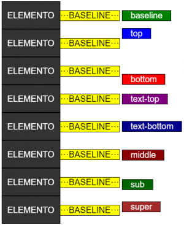

# Alineación y espaciado

### Espacio entre caracteres

La propiedad <mark style="color:blue;">**`letter-spacing`**</mark> permite incrementar o decrementar la distancia entre los distintos caracteres de un texto. Es posible asignar valores positivos o negativos de espaciado, según deseemos incrementar o decrementar dicha distancia.\
Veamos algunos ejemplos típicos de uso:

```css
h1 {
  letter-spacing: 3px;
}

h2 {
  letter-spacing: 2px;
}

h3 {
  letter-spacing: -1px;
}
```

### Espacio entre palabras

La propiedad <mark style="color:blue;">**`word-spacing`**</mark> permite incrementar o decrementar la distancia entre las distintas palabras de un texto. Es posible asignar valores positivos o negativos de espaciado, según deseemos incrementar o decrementar dicha distancia.\
Veamos un ejemplo típico de uso:

```css
p {
  word-spacing: 30px;
}
```

### Interlineado

La propiedad <mark style="color:blue;">**`line-height`**</mark> permite establecer el valor de interlineado (altura de línea). Si se indica el valor en %, éste se tomará respecto el tamaño de la fuente actual. Si se indica un valor numérico sin unidad de medición, este se empleará como multiplicador a aplicar al actual tamaño de fuente.\
Veamos algunos ejemplos de uso:

```css
/* Esta altura de línea no se recomienda ya que las líneas se solapan */
div.a {
    line-height: 0.5;
}
/* Esta altura sería la recomendada para la mayoría de escenarios */
div.b {
    line-height: 1.6;
}
/* Esta altura da aire al texto ya que el interlineado es espacioso */
div.c {
    line-height: 2;
}
```

### Alineación horizontal

La propiedad <mark style="color:blue;">**`text-align`**</mark> permite establecer la alineación del texto de un elemento.\
Las palabras reservadas que se admiten como posibles valores para la propiedad son:

* <mark style="color:orange;">**`left`**</mark> : Alinea el texto a la izquierda.
* <mark style="color:orange;">**`right`**</mark> : Alinea el texto a la derecha.
* <mark style="color:orange;">**`center`**</mark> : Centra el texto.
* <mark style="color:orange;">**`justify`**</mark> : Justifica el texto.

Veamos algunos ejemplos de uso:

```css
h1 {
    text-align: center;
}

p.date {
    text-align: right;
}

p.main {
    text-align: justify;
}
```

### Alineación vertical

La propiedad <mark style="color:blue;">**`vertical-align`**</mark> permite establecer la alineación vertical de un elemento. Nótese que todos los elementos se encuentran verticalmente alineados respecto una línea invisible que se denomina línea base o _baseline_.\
\
Las palabras reservadas que se admiten como posibles valores para la propiedad son:

* <mark style="color:orange;">**`baseline`**</mark> : Alinea el elemento seleccionado con la _baseline_ del elemento padre. Es el valor por defecto.
* <mark style="color:orange;">**`sub`**</mark> : Alinea el elemento seleccionado con la _subscript baseline_ del elemento padre. Aparece pues, algo por debajo que el resto de elementos adyacentes alineados a la _baseline_.
* <mark style="color:orange;">**`super`**</mark> : Alinea el elemento seleccionado con la _superscript baseline_ del elemento padre. Aparece pues, algo por encima que el resto de elementos adyacentes alineados a la _baseline_.
* <mark style="color:orange;">**`top`**</mark> : Alinea el elemento seleccionado con el límite superior del elemento más elevado de la línea.
* <mark style="color:orange;">**`bottom`**</mark> : Alinea el elemento seleccionado con el límite inferior del elemento más hundido de la línea.
* <mark style="color:orange;">**`middle`**</mark> : Alinea el elemento seleccionado con el punto medio del elemento padre (verticalmente).
* <mark style="color:orange;">**`text-top`**</mark> : Alinea el elemento seleccionado con el límite superior de la fuente del elemento padre.
* <mark style="color:orange;">**`text-bottom`**</mark> : Alinea el elemento seleccionado con el límite inferior de la fuente del elemento padre.

<figure><figcaption><p>Alineado vertical</p></figcaption></figure>

Además del uso de palabras reservadas, la propiedad admite valores numéricos que permiten levantar o soterrar el elemento respecto la línea base, por ello es posible introducir valores negativos (0 = _baseline_). En el supuesto de indicar un %, dicho porcentaje se realiza sobre el valor de la propiedad <mark style="color:blue;">**`line-height`**</mark>.

Veamos algunos ejemplos de uso:

```css
img.a {
  vertical-align: baseline;
}

img.b {
  vertical-align: middle;
}

img.c {
  vertical-align: 50%;
}

img.d {
  vertical-align: super;
}

img.e {
  vertical-align: -25px;
}
```

### Indentación

La propiedad <mark style="color:blue;">**`text-indent`**</mark> permite incrementar o decrementar la indentación de la primera línea de un texto. Es posible asignar valores positivos o negativos de indentación, según deseemos indentar hacia la derecha o hacia la izquierda.\
Veamos algunos ejemplos típicos de uso:

```css
div.a {
  text-indent: 50px;
}

div.b {
  text-indent: -2em;
}

div.c {
  text-indent: 30%;
}
```
