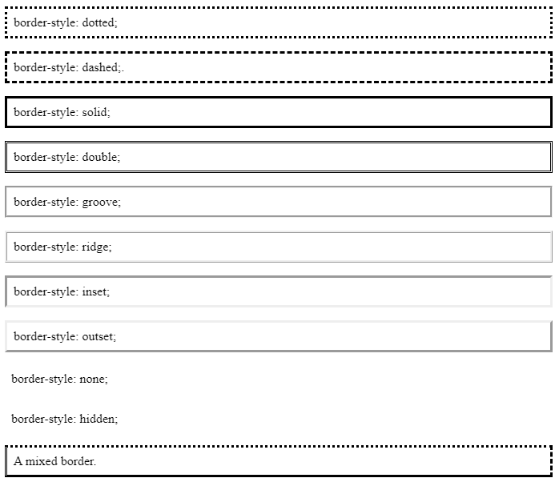

# Bordes

### Estilo

La propiedad <mark style="color:blue;">**`border-style`**</mark> especifica el tipo de borde a mostrar para el elemento HTML seleccionado.\
Su sintaxis es la siguiente:

```css
/* Mismo estilo para los 4 bordes (superior, derecho, inferior, izquierdo) */
border-style: style;

/* Bordes diferenciados para los bordes laterales y los superiores e inferiores */
border-style: styleVertical styleLateral;

/* Bordes diferenciados */
border-style: styleTop styleRight styleBottom styleLeft;

/* Bordes diferenciados e indicados explícitamente */
border-top-style: style;
border-right-style: style;
border-bottom-style: style;
border-left-style: style;s
```

Los valores admitidos por la propiedad se muestran a continuación a modo de ejemplo:

<figure><figcaption></figcaption></figure>

### Color

La propiedad <mark style="color:blue;">**`border-color`**</mark> especifica el color del borde a mostrar para el elemento HTML seleccionado.\
Su sintaxis es la siguiente:

```css
/* Mismo color para los 4 bordes (superior, derecho, inferior, izquierdo) */
border-color: color;

/* Colores diferenciados para los bordes laterales y los superiores e inferiores */
border-color: colorVertical colorLateral;

/* Bordes con colores diferenciados */
border-color: colorTop colorRight colorBottom colorLeft;

/* Bordes con colores diferenciados e indicados explícitamente */
border-top-color: color;
border-right-color: color;
border-bottom-color: color;
border-left-color: color;
```


Si no se define previamente un estilo de borde que sea visible nunca se verá el color asignado.


### Grosor

La propiedad <mark style="color:blue;">**`border-width`**</mark> especifica el grosor del borde a mostrar para el elemento HTML seleccionado.\
Su sintaxis es la siguiente:

```css
/* Mismo grosor para los 4 bordes (superior, derecho, inferior, izquierdo) */
border-width: size;

/* Grosor diferenciado para los bordes laterales y los superiores e inferiores */
border-color: sizeVertical sizeLateral;

/* Bordes con grosores diferenciados */
border-color: sizeTop sizeRight sizeBottom sizeLeft;

/* Bordes con grosores diferenciados e indicados explícitamente */
border-top-width: size;
border-right-width: size;
border-bottom-width: size;
border-left-width: size;
```

### Método abreviado: <mark style="color:blue;">**border**</mark>

La propiedad <mark style="color:blue;">**border**</mark> es un método abreviado que permite establecer el **grosor**, **estilo** y **color** del borde del elemento seleccionado mediante una única asignación.\
El grosor se corresponde con la propiedad <mark style="color:blue;">**`border-width`**</mark>, el estilo con la propiedad <mark style="color:blue;">**`border-style`**</mark> y el color con la propiedad <mark style="color:blue;">**`border-color`**</mark>.\


Su sintaxis es la siguiente:

```css
/* Idéntico borde para los 4 lados */
border: width style color;
/* Borde superior diferenciado */
border-top: width style color;
/* Borde lateral derecho diferenciado */
border-right: width style color;
/* Borde inferior diferenciado */
border-bottom: width style color;
/* Borde lateral izquierdo diferenciado */
border-left: width style color;
```

A continuación, se presentan algunos ejemplos de uso:

```css
/* Borde de 2 píxeles de grosor, rojo y solido */
h1 {
  border: 2px solid red;
}
/* Borde superior de 2 milímetros de grosor, azul y punteado +
   Borde izquierdo con un grosor del 1% el alto del viewport y de estilo dashed */
h2 {
  border-top: 2mm dotted #0000FF;
  border-left: 1vw dashed;
}
/* Borde verde semitransparente y  de estilo doble */
p span {
  border: rgba(0,255,0,0.5) double;
}
```

### Esquinas redondeadas

La propiedad <mark style="color:blue;">**`border-radius`**</mark> especifica el grado de redondez de las esquinas del borde a mostrar para el elemento HTML seleccionado.\


Su sintaxis es la siguiente:

```css
/* Misma redondez para las 4 esquinas */
border-radius: size;

/* Redondez diferenciada para las 4 esquinas */
border-radius: sizeTopLeft sizeTopRight sizeBottomRight sizeBottomLeft;
```


Los valores típicos suelen ir de los 5 a los 12 píxeles.

