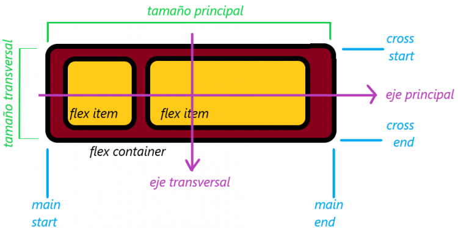

# Flexbox

El modelo **Flexbox** tiene por objetivo proporcionar una forma más eficiente de diseñar, alinear y distribuir el espacio entre los elementos dentro de un contenedor, incluso cuando su tamaño es desconocido y / o dinámico. La idea principal detrás del diseño flexible es darle al contenedor la capacidad de alterar el ancho / alto de sus contenidos (y el orden) para llenar mejor el espacio disponible (principalmente para acomodarse a todo tipo de dispositivos de visualización y tamaños de pantalla). Un contenedor flexible expande los elementos para llenar el espacio libre disponible o los reduce para evitar el desbordamiento.


El diseño de Flexbox es el más apropiado para los componentes de una aplicación web y los diseños de pequeña escala, mientras que el diseño de cuadrícula (**CSS Grid**) está orientado a diseños de mayor escala.


Dado que flexbox es un módulo CSS completo y no una única propiedad, involucra muchas cosas, incluido un conjunto completo de propiedades. Algunas de ellas están destinadas a establecerse en el contenedor ("contenedor flexible"), otras a los elementos secundarios ("elementos flexibles"). Mientras que el diseño tradicional se basa en direcciones de flujo en bloque (block) y en línea (inline), el diseño flexible se basa en "direcciones de flujo flexible". Para entender el cambio de paradigma, a continuación se presentan sus características esenciales:

<figure><figcaption></figcaption></figure>

Los elementos se colocarán siguiendo el eje principal (desde el **main-start** hasta el **main-end**) o el eje transversal (desde el **cross-start** hasta el **cross-end**).

* **eje principal**: el eje principal de un contenedor flexible es el eje primario a lo largo del cual se disponen los elementos flexibles. El eje principal no tiene por que ser necesariamente el eje horizontal; pues esto depende de la propiedad de <mark style="color:blue;">**`flex-direction`**</mark>.
* **main-start** y **main-end**: los elementos flexibles se colocan dentro del contenedor comenzando desde _**main-start**_ y yendo a _**main-end**_.
* **tamaño principal**: el ancho o la altura de un elemento flexible, cualquiera que sea la dimensión principal, es el tamaño principal del elemento. La propiedad de tamaño principal del elemento flexible es la propiedad <mark style="color:blue;">**`width`**</mark> o <mark style="color:blue;">**`height`**</mark>, según sea la que esté en la dimensión principal.
* **eje transversal**: eje perpendicular al principal cuya dirección depende de la dirección del eje principal.
* **cross-start** y **cross-end**: las filas flexibles se rellenan con elementos y se colocan en el contenedor comenzando en el lado del **cross-start** del contenedor flexible y yendo hacia el lado **cross-end**.
* **tamaño transversal**: el ancho o la altura de un elemento flexible, cualquiera que esté en la dimensión transversal, es el tamaño transversal del elemento.

\
Para activar el funcionamiento de **Flexbox** deberemos añadir la siguiente propiedad CSS a nuestro contenedor flexible:

```css
/* Contenedor flex de tipo block */
.flexblockcontainer {
  display: flex;
}
/* Contenedor flex de tipo inline */
.flexinlinecontainer {
  display: inline-flex;
}
```
