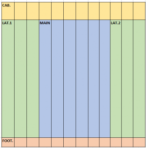
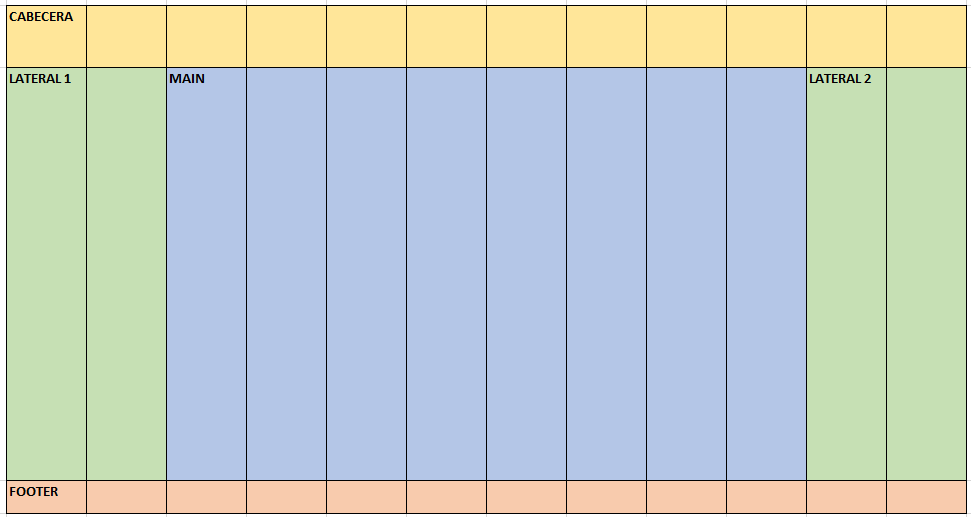

# Cuadrícula

La mayoría de webs distribuyen sus elementos utilizando un diseño basado en cuadrícula, pues facilita enormemente el posicionado de las distintas secciones y elementos, proporcionando un marco de trabajo adecuado para la maquetación web. Las cuadrículas de tipo **web responsive** utilizan habitualmente una división del espacio en <mark style="background-color:orange;">**12 columnas**</mark> que ocupan el 100% del espacio disponible en el ancho del **viewport**, comprimiéndose o expandiéndose según sea el tamaño de la ventana del navegador.&#x20;

<figure><figcaption><p>Layout de Ejemplo para tablet</p></figcaption></figure>

\
Para construir una cuadrícula responsiva, lo primero es asegurarnos que todos elementos HTML tienen la propiedad <mark style="color:blue;">**`box-sizing`**</mark> con valor <mark style="color:orange;">**`border-box`**</mark>, lo que implica que los márgenes externos e internos se incluyen en el valor total de las propiedades <mark style="color:blue;">**`width`**</mark> y <mark style="color:blue;">**`height`**</mark>. Así pues, conviene añadir a nuestro código CSS:

```css
  *{
    box-sizing: border-box;
  }
```

Además, crearemos nuestra cuadrícula responsiva de 12 columnas mediante la definición de una serie de clases que nos permitirán indicar la proporción de espacio total ocupado de los distintos elementos HTML en función del número de columnas que les hayamos asignado. Por ejemplo, 1 única columna representa un ancho de 1columna /12columnas x 100 = 8.33%, 2 columnas representan un ancho de 2columnas / 12 columnas x 100 = 16.67% y así sucesivamente hasta las 12 columnas que representan el 100% del ancho del _viewport_.\
Tras realizar todos los cálculos necesarios para calcular el % de ancho que ocupan las diferentes configuraciones de columnas, establecemos las siguientes clases CSS:

```css
  .col-1 {width: 8.33%;}
  .col-2 {width: 16.66%;}
  .col-3 {width: 25%;}
  .col-4 {width: 33.33%;}
  .col-5 {width: 41.66%;}
  .col-6 {width: 50%;}
  .col-7 {width: 58.33%;}
  .col-8 {width: 66.66%;}
  .col-9 {width: 75%;}
  .col-10 {width: 83.33%;}
  .col-11 {width: 91.66%;}
  .col-12 {width: 100%;}
```

Además, para que el funcionamiento de la cuadrícula sea el esperado, deberemos flotar nuestras columnas a la izquierda:

```css
  [class*="col-"] {
    float: left;
  }
```

Finalmente y a fin de poder tener filas con columnas sin ocupar es imprescindible que las distintas filas se organizen entorno a una nueva clase **row**, que mediante un pequeño truco CSS se encargará de eliminar el efecto de flotación al finalizar la fila.

```css
  .row::after {
    content: "";
    clear: both;
    display: table;
  }
```

Así pues, dado el siguiente diseño:

<figure><figcaption></figcaption></figure>

Deberíamos emplear el siguiente código para su correcto funcionamiento responsivo:

```html
<!DOCTYPE html>
<html lang="es">
  <head>
    <meta charset="utf-8">
    <meta name="viewport" content="width=device-width, initial-scale=1.0">
    <style>
    *{
        box-sizing: border-box;
        margin: 0;
      }
      header, aside, main, footer{
        color: white;
        background-color: darkblue;
        border: 1px solid blue;
      }
      header{height: 20vh;}
      aside, main{height: 70vh;}
      footer{height: 10vh;}
      .row::after {
        content: "";
        clear: both;
        display: table;
      }
      [class*="col-"] {
        float: left;
        padding: 15px;
      }
      .col-1 {width: 8.33%;}
      .col-2 {width: 16.66%;}
      .col-3 {width: 25%;}
      .col-4 {width: 33.33%;}
      .col-5 {width: 41.66%;}
      .col-6 {width: 50%;}
      .col-7 {width: 58.33%;}
      .col-8 {width: 66.66%;}
      .col-9 {width: 75%;}
      .col-10 {width: 83.33%;}
      .col-11 {width: 91.66%;}
      .col-12 {width: 100%;}
    </style>
  </head>
  <body>
    <div class="row">
      <header class="col-12">CABECERA</header>
    </div>
    <div class="row">
      <aside class="col-2">LAT. 1</aside>
      <main class="col-8">PRINCIPAL</main>
      <aside class="col-2">LAT. 2</aside>
    </div>
    <div class="row">
      <footer class="col-12">PIE</footer>
    </div>
  </body>
</html>
```


Aunque mediante las reglas CSS que hemos visto nuestro diseño es web responsive, aún nos falta ver cómo podemos alterar su comportamiento en función del tamaño de pantalla del dispositivo que estemos utilizando para renderizar la web.

