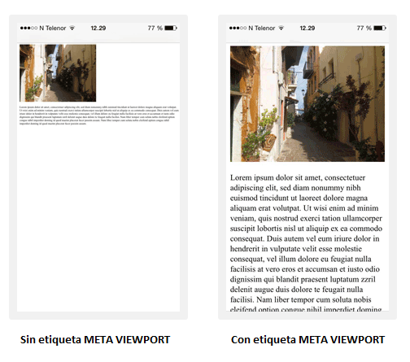

# Viewport

El **viewport** es el área visible por el usuario en una página web, que varía según el dispositivo, siendo más pequeña en un teléfono móvil que en la pantalla de un equipo de sobremesa. Antes de la llegada de las tablets y los smartphones, las páginas web se diseñaban solo para pantallas de equipos de sobremesa, y era común que las páginas web tuvieran un diseño estático y un tamaño fijo. Tras la irrupción de las tablets y los smartphones, la mayoría de páginas web de tamaño fijo presentaban un tamaño demasiado grande para el _viewport_. Para solucionar este problema, los navegadores de tablets y smartphones redujeron las páginas web para que se ajustaran a la pantalla. Esta solución era un simple parche, ya que con ello no se evitaban los problemas de navegabilidad que implican el uso de un diseño de tamaño fijo no responsivo.\
\
La solución definitiva la introdujo HTML5 al proporcionar un método para permitir que los diseñadores web tomaran el control del **viewport**, a través de la etiqueta `<`<mark style="color:green;">**`meta`**</mark>`>`&#x20;

```html
<meta name="viewport" content="width=device-width, initial-scale=1.0">
```

La parte `width=device-width` establece que el ancho de la página debe ser el ancho de la pantalla del dispositivo.\
La parte `initial-scale=1.0` establece el nivel de zoom inicial cuando el navegador carga por primera vez la página.

Esta etiqueta resulta imprescindible para evitar que los usuarios deban desplazarse horizontalmente para navegar por la web, evitando así una experiencia de usuario muy deficiente.\
Además deberían seguirse una serie de reglas adicionales:

1. NO utilices elementos grandes de ancho fijo: por ejemplo, si una imagen se muestra con un ancho superior al ancho del _viewport_, puede obligar al usuario a desplazarse horizontalmente. No te olvides de ajustar este contenido para que se ajuste al ancho del _viewport_.
2. NO permitas que el contenido dependa de un ancho de **viewport** particular para renderizarse correctamente: dado que las dimensiones y el ancho de la pantalla en píxeles varían ampliamente entre dispositivos.
3. Utiliza **CSS Media Queries** para aplicar diferentes estilos para pantallas pequeñas y grandes: considera usar valores de ancho relativo, como ancho: 100%. Además, ten cuidado con utilizar grandes valores de posicionamiento absoluto pues pueden provocar que el elemento caiga fuera del _viewport_ en dispositivos pequeños.
4. NO te olvides la inclusión de la etiqueta `<`<mark style="color:green;">**`meta`**</mark>**` `**<mark style="color:blue;">**`name`**</mark>**`=`**<mark style="color:purple;">**`"viewport"`**</mark> <mark style="color:blue;">**content**</mark>**`=`**<mark style="color:purple;">**`"width=device-width, initial-scale=1.0"`**</mark>`>`.

<figure><figcaption></figcaption></figure>
